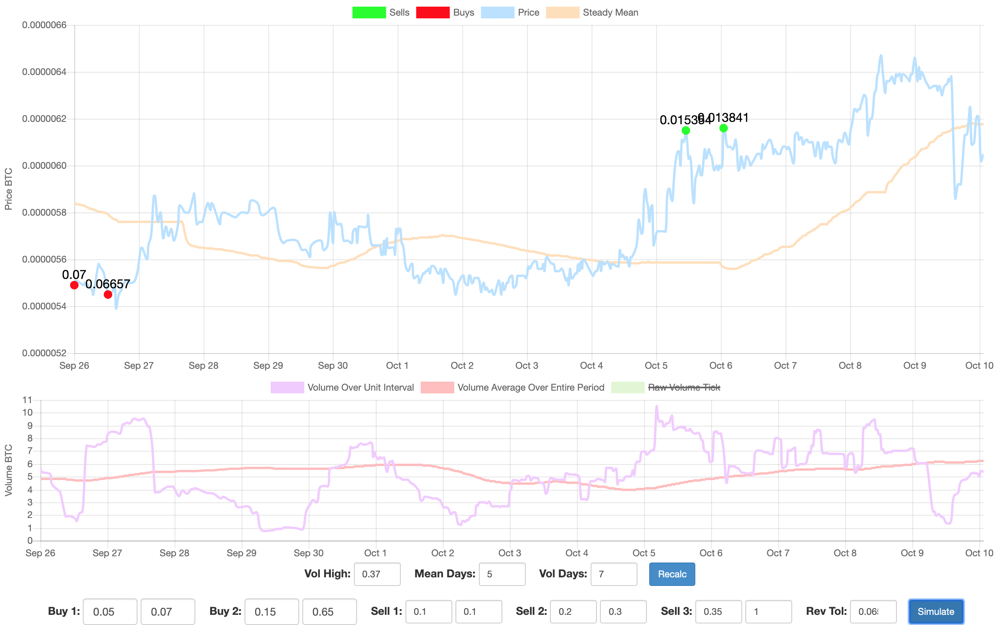

Short term volatility bot for up and coming altcoins with a simple mean-reversion strategy

# Getting Started

Start mongoDb on port 3000 with ```mongod --dbpath=./data/db --port=3000``` in a different screen or in the background

Run the bot with ```node main.js``` after having installed the necessary dependencies with `npm i`

# Usage

Go to `http://localhost:4000/admin?index=k` to run simulations of trading the kth coin added in the `startup_bot()` function in `main.js`

The bot UI allows the user to run various simulations on each coin, setting thresholds for volume spikes during which the moving average of the price should not be effected. Changes to this setting along with the period over which to take the floating average of volume and mean go into effect when the `Recalc`  button in the UI is pressed.

The bot also allows for setting different Buy and Sell thresholds, where `Buy  0.05 0.1` for example tells the bot to buy 5% of the total amount of the coin the user desires to hold when its current price goes 10% above its moving average.

Once simulate is clicked, buy and sells will appear, as depicted below, which can be hovered over to see their amount in units of the coin. More in depth statistics about this sequence of trades can be found in the console.


